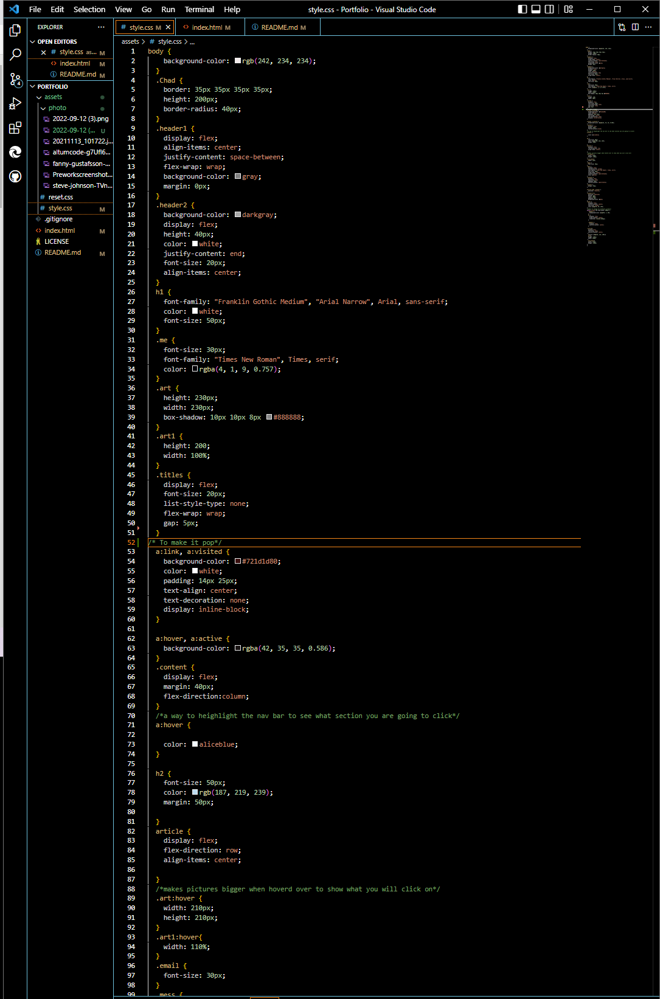

# Prework Study Guide Webpage

## Description

This Portfolio project was made by scratch to help learn how HTML and CSS is created.

## Installation

N/A

## Usage

To use this Portfolio, you can use it as a template for future development. you can use Control+Shift+I to open up how it was made and edit as you please.

## Credits

N/A

## License

Please refer to the LICENSE in the repo.

.png)
.png)
